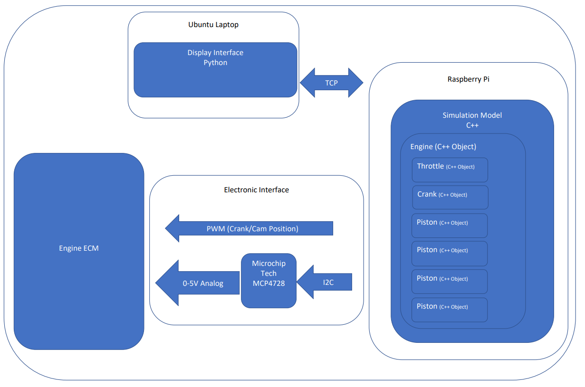
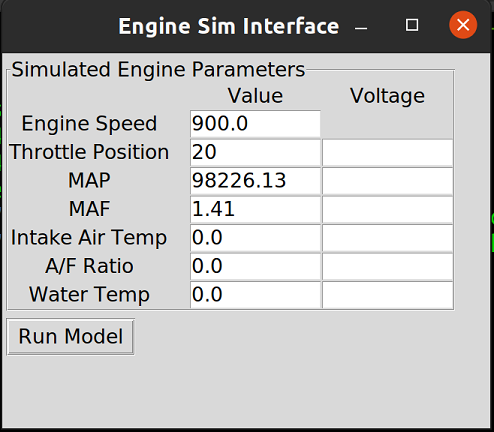
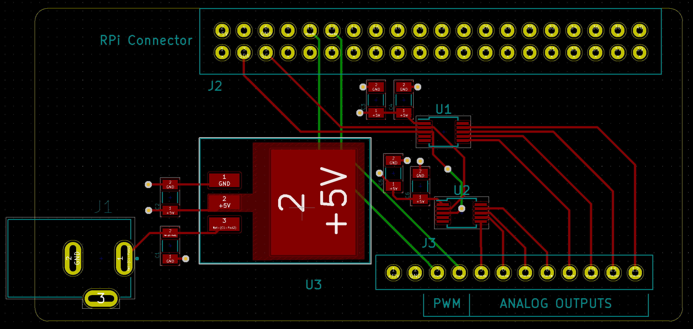

# Hardware in Loop R18Z4 Engine Model

The aim of this project is to create a engine simulation in C++ that allows for sensor values to be calculated and sent via a DAC/PWM output to a engine ECM to simulate a running engine. 

If successful it will provide accurate enough sensor values that firstly, a factory ECM will run without throwing any diagnositcs and secondly, it could serve as a test bench to develop an engine ECM design from scratch. In the case of the second option this would include a custom designed PCB and control software. 

The overall system model is as follows;

R18Z4Sim.cpp is the main cpp file. 

 # User Interface

 The model is controlled through a user interface created with python/tinkter running on a ubuntu laptop, the IPC is done with TCP/IP between the laptop and raspberry pi. 

# PCB Design

Initial PCB design for testing, needs further development. Also needs to considering returning output signals from the engine ECM.

